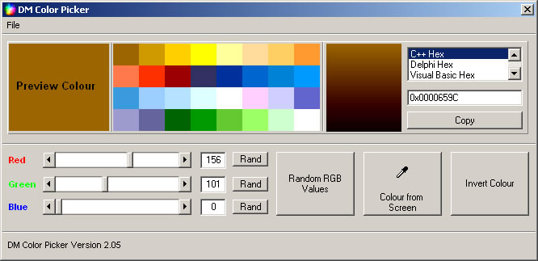



## DM Color Picker Version 2\.05

### Description

Hi, well after seeing a Color picker on here. It remined me of my old version I updated but forgot to submit anyway. I thought I do it now.

Ok DM Color Picker, You can save and load your own pallets also comes with 15 or so ready made ones. You can pick a color from the screen, has support for VB hex color, VB long color, RGB , C++, Delphi and HTML anyway hope you like it.
 
### More Info
 

             |
---                |---
**Submitted On**   |2003-01-09 12:14:34
**By**             |[dreamvb](https://github.com/Planet-Source-Code/PSCIndex/blob/master/ByAuthor/dreamvb.md)
**Level**          |Beginner
**User Rating**    |4.7 (33 globes from 7 users)
**Compatibility**  |VB 6\.0
**Category**       |[Complete Applications](https://github.com/Planet-Source-Code/PSCIndex/blob/master/ByCategory/complete-applications__1-27.md)
**World**          |[Visual Basic](https://github.com/Planet-Source-Code/PSCIndex/blob/master/ByWorld/visual-basic.md)
**Archive File**   |[DM\_Color\_P1842751222005\.zip](https://github.com/Planet-Source-Code/dreamvb-dm-color-picker-version-2-05__1-58434/archive/master.zip)

